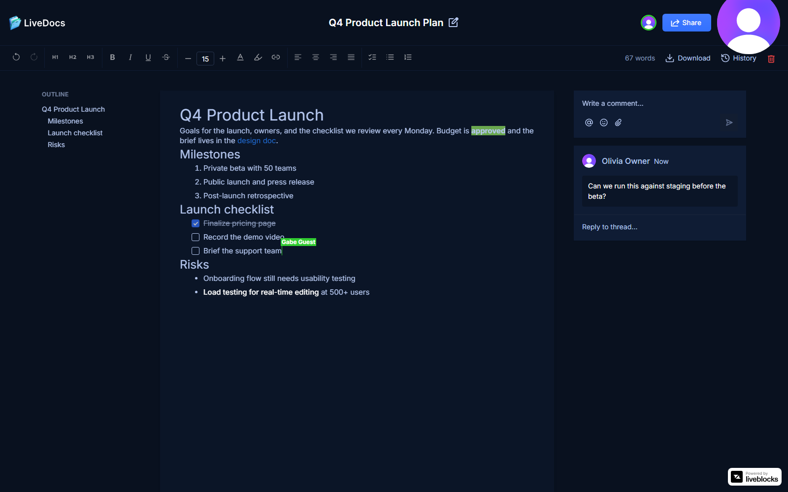
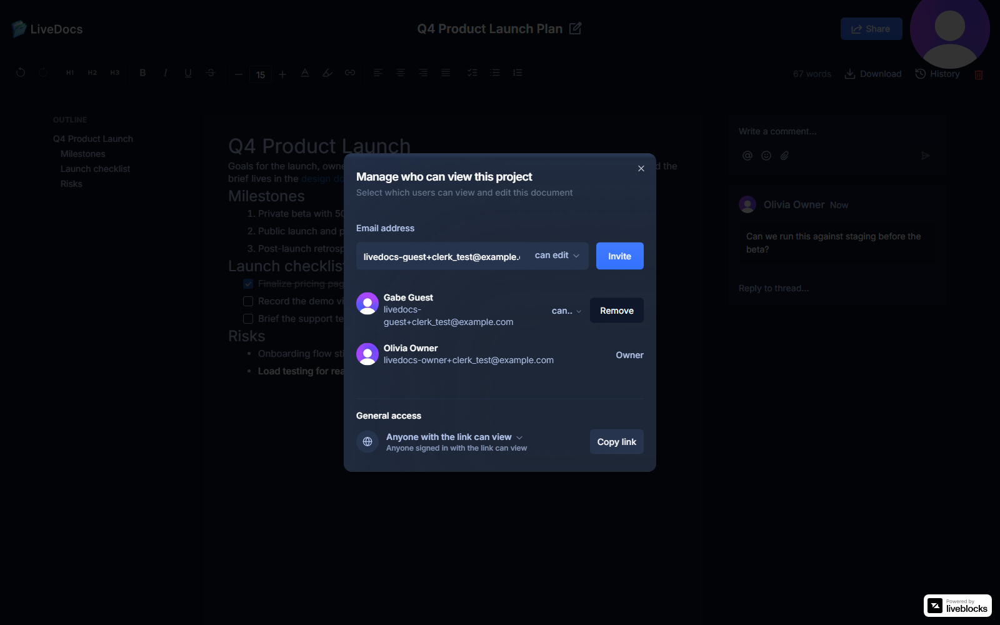
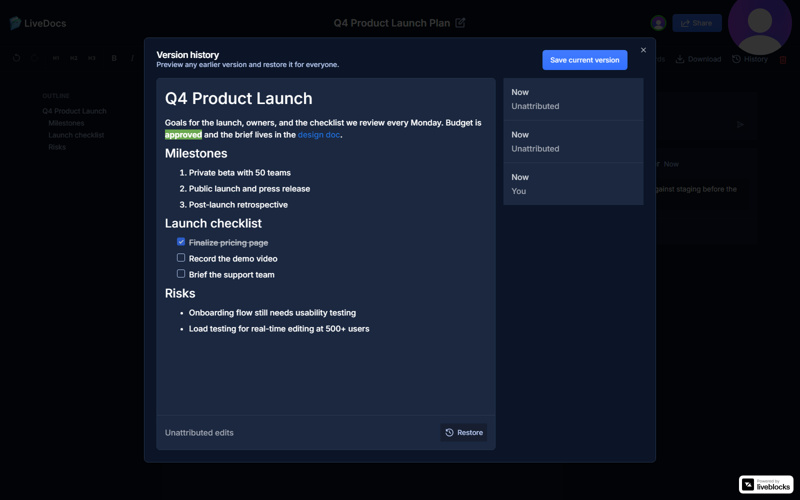
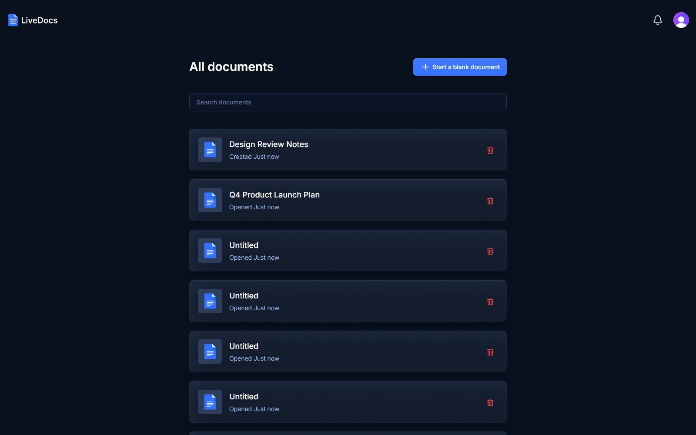
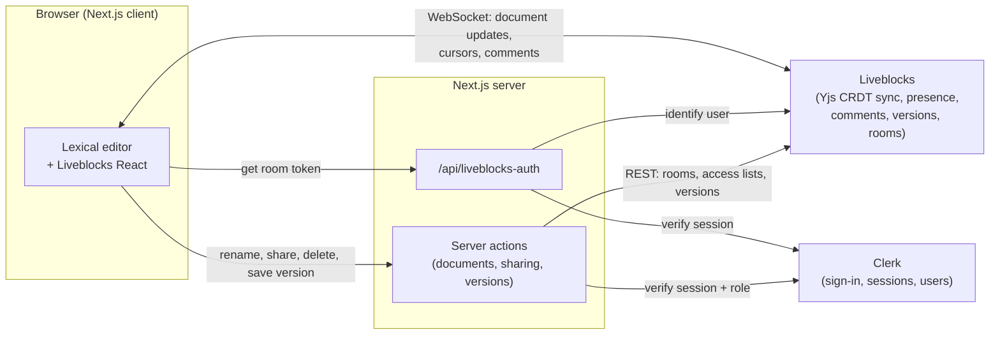

<div align="center">
  
  <br />
  <br />
  <p>
    <a href="https://github.com/Troy2727/coedit_flow/actions/workflows/ci.yml"></a>
  </p>
  <p>
    
    
    
    
    
    
    
  </p>
  <h1>LiveDocs</h1>
  <p><b>A real-time collaborative document editor, inspired by Google Docs.</b></p>
  <p>
    Several people can edit the same document at once and see each other's cursors, comment on text,
    share with view or edit access, and roll back to earlier versions. It's built on a CRDT sync engine,
    with permissions enforced on the server and an end-to-end test suite that drives two browsers at once.
  </p>
</div>

<br />



---

## 📋 Table of Contents

1. [Features](#-features)
2. [Screenshots](#-screenshots)
3. [Architecture](#-architecture)
4. [Engineering Highlights](#-engineering-highlights)
5. [Tech Stack](#-tech-stack)
6. [Getting Started](#-getting-started)
7. [Testing](#-testing)
8. [Project Structure](#-project-structure)
9. [Roadmap](#-roadmap)
10. [Author](#-author)

---

## ✨ Features

**👥 Real-time collaboration**
- Multiple people edit the same document simultaneously; changes merge without conflicts (CRDT)
- Live cursors and selections labelled with each collaborator's name
- Avatars of everyone currently in the document

**📝 Rich-text editing**
- Headings, bold, italic, underline, strikethrough, and text alignment
- Font size, text color, and highlight color
- Bulleted, numbered, and checklist lists (Tab to nest)
- Tables with insert/delete row and column controls
- Images by URL with alt text (only `http(s)` sources render)
- Links with `Ctrl+K`, auto-linking of typed URLs, and blocking of unsafe (`javascript:`) links
- Markdown shortcuts: `#` headings, `-` bullets, `1.` numbers, `[]` checkboxes, `**bold**`, `[text](url)`
- Every toolbar button shows its name and keyboard shortcut on hover

**💬 Comments & notifications**
- Comment on any selected text, with threaded replies and resolving
- `@mentions` of collaborators
- In-app notification inbox for mentions, replies, and documents shared with you

**🔗 Sharing & permissions**
- Invite people by email as **viewers** (read-only) or **editors**
- People without an account get an emailed invitation; signing up through it opens the shared document (they show as "Pending invite" until then)
- "**Anyone with the link** can view / edit", plus Copy link
- Only the owner can delete a document; the owner's access can't be removed

**🕓 Version history**
- Save a version at any time, preview older versions read-only, and restore one for everyone

**📄 Document tools**
- Outline sidebar built from the document's headings (click to jump)
- Live word count
- Download as **Markdown**, or as **PDF** through the browser's print dialog (print styles hide the app UI)

**🗂️ Documents home**
- Search documents by title
- Sorted by when each document was last opened

---

## 🖼️ Screenshots

**Sharing: invite by email, choose a role, or share by link**



**Version history: preview any saved version and restore it**



**Home: all documents, searchable and sorted by last opened**



---

## 🏗️ Architecture



- **Each document is a Liveblocks room.** The room holds the Yjs document, comments, and versions. Its metadata holds the title and owner, and its access lists hold who can view or edit. There's no separate database.
- **The editor syncs directly with Liveblocks** over a WebSocket. The Next.js server is only involved to issue a room token and to perform privileged actions.
- **Clerk** handles sign-in (Google, or email + password with email verification) and supplies user names and avatars.

---

## 🔍 Engineering Highlights

- **Conflict-free real-time editing with CRDTs.** Documents are Yjs CRDTs bound to Lexical. When two people type in the same place, edits merge deterministically on every client, with no locking and no "last write wins".
- **Authorization on the server, not just in the UI.** Next.js server actions are public HTTP endpoints, so hiding a button isn't security. Every action re-verifies the Clerk session and checks the caller's role on that room before touching data: editors can rename and share, only owners can delete, and nobody can change the owner's access. Liveblocks separately enforces room permissions on the real-time connection.
- **One permissions model for invites and link sharing.** Invited users get per-email access. "Anyone with the link" maps to the room's default access, and every server-side check falls back to it.
- **End-to-end tests with two real browsers.** Playwright signs in two Clerk test users and verifies that one user's typing and cursor appear in the other's browser live. It also covers viewer restrictions, link sharing, version restore, and formatting. Making this suite reliable surfaced three real issues:
  - a system clock drifting 6 seconds, which made Clerk reject fresh session tokens
  - a mismatch between the Liveblocks SDK's TypeScript types and its API responses
  - a development-only React Strict Mode double-mount that detached a collaborator's editor. The suite now runs against a production build.
- **A sync race found by CI, fixed at the root.** On GitHub's runners, a collaborator who joined a document sometimes got a blank editor that threw `could not find element node` on the next remote edit. Lexical loads the shared Yjs document only through an `observeDeep` listener, which it registers after creating the provider. The Liveblocks provider ignores `connect()` and syncs immediately, so a fast initial sync could land before Lexical was listening. A regression test reproduces it by throttling the joining browser's CPU (failed 3/3 before the fix). A small `patch-package` patch makes Lexical load any state already in the document once it starts listening.
- **An invite bug that only happened in production.** On the deployed site, an invited user could be stuck on the loader. The room's permissions were already correct, and the user's token was identical to the one from a working local run, yet Liveblocks closed the connection with `4001`. Timed probes showed that a permission change made from Vercel took about 30–60 seconds to reach Liveblocks' realtime servers, while the same change made locally applied at once. The client gives up on `4001`, so the app now retries the connection for up to two minutes. The server has already verified access before the page renders. A test reproduces the denial by intercepting the WebSocket and fails without the retry.

---

## ⚙️ Tech Stack

| Layer | Technology |
|---|---|
| Framework | [Next.js 14](https://nextjs.org) (App Router, Server Actions), React 18, TypeScript |
| Editor | [Lexical](https://lexical.dev) with list, link, markdown, and table-of-contents plugins |
| Real-time | [Liveblocks](https://liveblocks.io) (Yjs CRDT sync, presence, comments, notifications, version history) |
| Auth | [Clerk](https://clerk.com) (Google OAuth, email + password) |
| UI | [Tailwind CSS](https://tailwindcss.com), [shadcn/ui](https://ui.shadcn.com) (Radix), [Lucide](https://lucide.dev) icons |
| Testing | [Playwright](https://playwright.dev) with [@clerk/testing](https://clerk.com/docs/testing/playwright/overview) |

---

## 🚀 Getting Started

**Prerequisites:** [Node.js](https://nodejs.org) 18+, plus free [Clerk](https://clerk.com) and [Liveblocks](https://liveblocks.io) accounts.

```bash
git clone https://github.com/Troy2727/coedit_flow.git
cd coedit_flow
npm install
```

Create a `.env.local` file in the project root (it's git-ignored):

```env
# Clerk: dashboard.clerk.com → API Keys
NEXT_PUBLIC_CLERK_PUBLISHABLE_KEY=
CLERK_SECRET_KEY=

# Liveblocks: liveblocks.io/dashboard → API keys
LIVEBLOCKS_SECRET_KEY=
```

In the Clerk dashboard, under **User & Authentication**, enable **Email address** and **Password**, and optionally **Google**. To have versions created automatically as well as on demand, enable **Version history** in your Liveblocks project settings.

```bash
npm run dev
```

Open [http://localhost:3001](http://localhost:3001).

---

## 🧪 Testing

```bash
npx playwright install chromium   # first time only
npm run test:e2e                  # builds the app and runs 26 end-to-end tests
```

GitHub Actions runs the type check and the full end-to-end suite on every pull request and push to `main` (`.github/workflows/ci.yml`).

The tests build the app for production and serve it on port 3002, so they can run while `npm run dev` is using 3001. They create two Clerk test users (`+clerk_test` addresses, so no real email is ever sent) and delete every document they create when they finish.

To regenerate the screenshots in this README: `npm run screenshots`.

---

## 📁 Project Structure

```
app/
  (root)/page.tsx                 Documents home (search, last opened)
  (root)/documents/[id]/page.tsx  Document page: loads the room, resolves the user's role
  api/liveblocks-auth/route.ts    Issues Liveblocks room tokens for signed-in users
components/
  editor/                         Lexical editor, toolbar, and plugins
  VersionHistory.tsx              Version history panel
  ShareModal.tsx, GeneralAccess.tsx  Invites, roles, and link sharing
lib/actions/                      Server actions with session and role checks
e2e/                              Playwright end-to-end tests
```

---

## 🗺️ Roadmap

- Image uploads (images can currently be added by URL)
- Suggesting mode (tracked changes)
- AI writing assistant (improve, summarize, translate a selection)
- Commenter role and ownership transfer

---

## 👨‍💻 Author

**Alex Mieses** · [GitHub](https://github.com/Troy2727)

---

## 📄 License

This project is licensed under the MIT License - see the LICENSE file for details.
